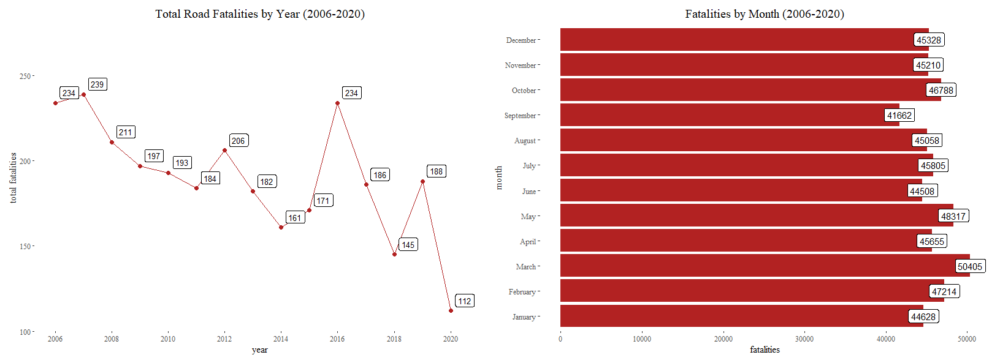
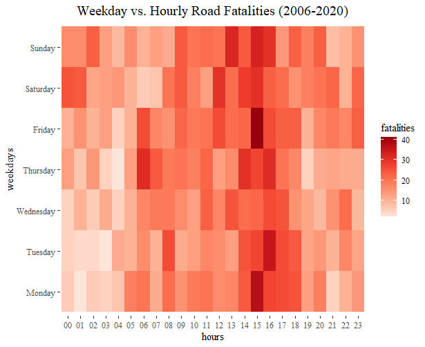
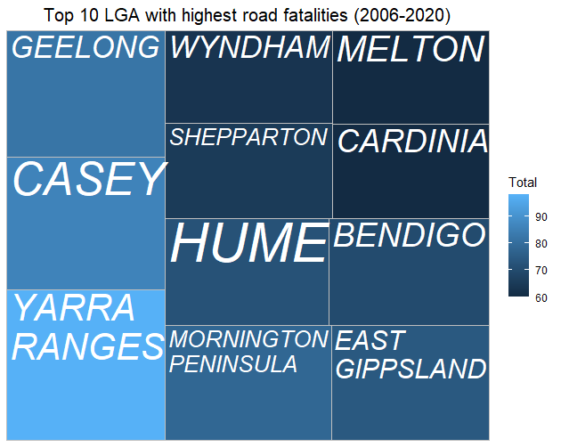
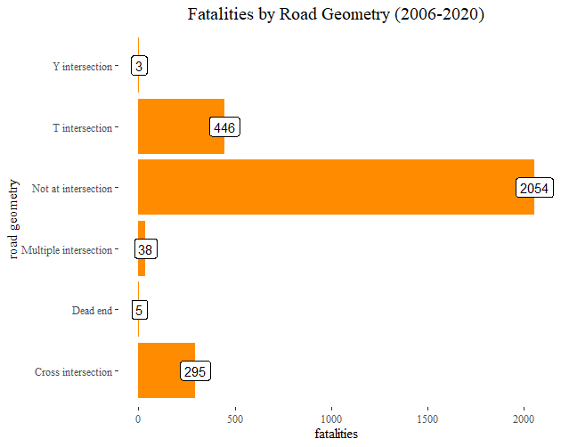

# Exploratory Data Analysis

To facilitate analysis and discovery of insights from the road accident dataset, our team classifies the findings into three major areas of questions:

*	The "When" - Period of Time

*	The "Where" - Geographical Location

*	The "How" - Additional Factors

Additionally, we will filter the datasheet to include only values with "SEATING POSITION" equal to drivers, as this will aid us in determining the cause of road deaths much better.

## The "When" - Time
From 2006 until 2020, the number of deaths is depicted in Figure 1, with each month represented separately. The months of February to May are the most deadly. By contrast, during the year, July and September are the months of have the fewest fatalities.

{width=600px}

The intensity of fatalities at each hour of the day is depicted in the heat map to the right (Figure 2). On most days, the biggest number of deaths occurs at 15:00, when the most people are at their most vulnerable. However, it is possible that this is due to the school's dismissal time, during which the school zone measures are enforced.

{width=300px}

In terms of fatalities by time, it shown that the fatalities are high during the weekdays at 15:00 and 16:00. However, during the weekends, the trend starts increasing from 12:00 to 15:00 and declines from there. 

{width=500px}

The trend in fatalities throughout the weekdays and weekends is depicted by the candlestick charts shown above. The number of fatalities is highest during the weekday afternoons and evenings between 15:00 and 16:00. However, on weekends, the trend begins to increase from 12:00 to 15:00 and then begins to decline from there.

{width=300px}

## The “Where” – Location

Figure 5 demonstrates the top 10 LGA locations with the highest number of deaths in Victoria. “GEELONG”, “CASEY” and “YARRA RANGES” appear to be the top 3 LGA areas with the highest fatalities number from road accidents. However, there is no direct connections between the high number of road toll with the level of road safety in these areas since the data could be biased toward the population density since the more people living there will possibly have high chances of getting higher number of road accidents. 

{width=300px}

Additionally, in terms of casual relationships between location and fatality rate, another thing should be noticed is that the vast majority of fatalities have occurred on routes that do not have any intersections. As a result, the majority of accidents occur on highways. In addition, there are numerous fatalities at the 'T' and 'Cross' intersections.

{width=300px}

## The “Why” – Other factors

It is pretty obvious that the majority of fatalities happened on highways with speed limits of 100km/h or above, which makes sense given that a motorist is unlikely to survive a crash at such a high rate of speed (Figure 7). The second biggest number of fatalities occurs on highways with speed restrictions of 80km/h and 60km/h, respectively.

{width=300px}

In terms of death by road users, motor vehicle drivers accounted for the vast majority of fatalities (73 percent), followed by motorcycle riders (22 percent) and bicycles (14 percent) (5 percent ). A further concern is that nearly half of the fatalities were caused by a collision with another motor vehicle. In the second largest number of fatalities, a collision with a stationary object on the road was the cause.

{width=600px}

Considering road surface conditions, muddy roads were the most dangerous, followed by slippery and wet roads, which accounted for the majority of fatalities. However, it is said that there is no strong differences of the number of road tolls between weather conditions even though Rain and Cloudy appear to have more car fatalities as the number is not very significant.

{width=600px}