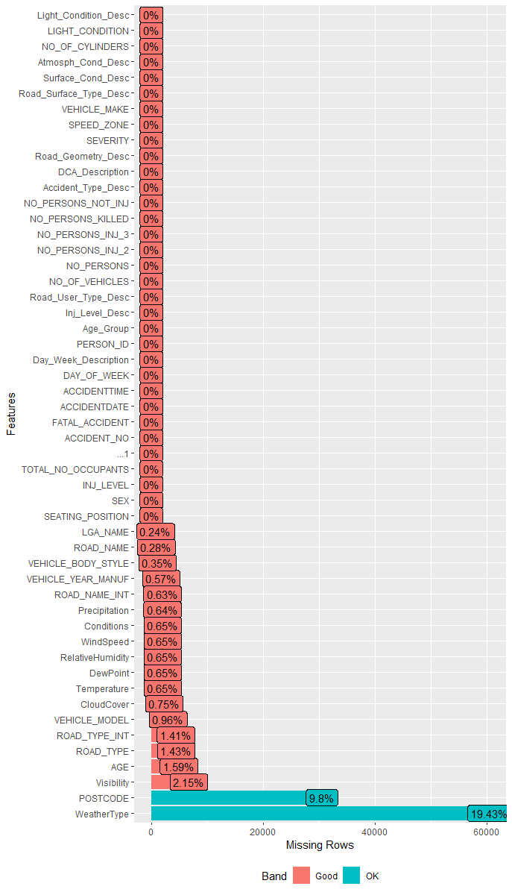
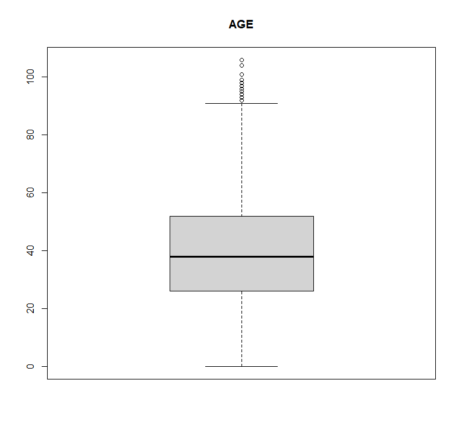
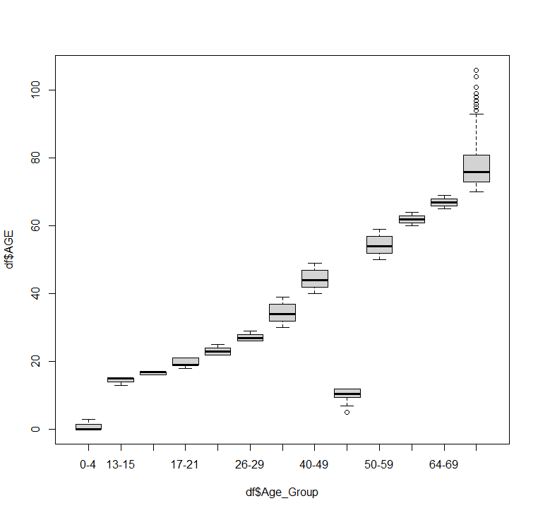
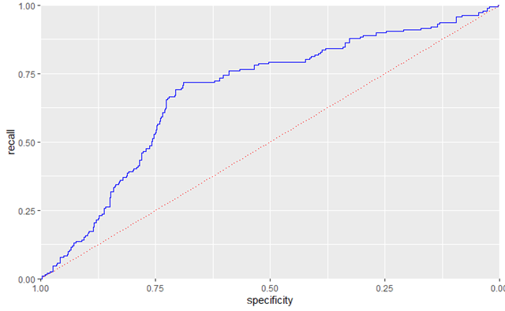

# Method

## Regression Model

In our study, we chose Logistic Regression Model to tackle the research questions. According to Menard (2002), logistic regression models are used to model the probability of a certain event based on independent predictor variables. 

While more sophisticated machine learning (ML) techniques have arisen and been applied to accident investigations over the last decade, logistic regression offers several advantages over ML techniques that support its use in our group study.

To begin, regression model findings are easy to interpret. Only the independent variables and their coefficients are required to represent the model in a single formula. The model's coefficients can be used to determine critical variables, as well as the amount and direction of association between each independent variable (i.e., risk factor) and the dependent variable (fatalities rate).

Second, once risk factors are discovered, creating a logistic regression model is straightforward and does not require tweaking multiple hyperparameters, as machine learning methods do. Due to this property, logistic regression is frequently used as the first classifier in predictive research and serves as a valid baseline for more advanced classifiers.

Third, while association rules might be effective for identifying latent patterns in huge data sets, they are fundamentally distinct from classification methods such as logistic regression modeling.

## Data Preparation

### Data Filtering

Traditionally, building statistical models starts with selecting variables that can result in a parsimonious model (i.e., having as few variables as possible). In order to do that, the first step is to edit it so that each point is genuinely useful, as larger is not necessarily better (Christensen, 2020). One simple solution is to clearly understand what problems we expect to resolve from our dataset. 

Since the aim of this project was to predict the factors that are likely to contribute to deaths from road accidents, we filtered the data points containing the variables 'Drivers' and 'Motorcyclists' of the Road User Types to avoid any bias during analysis. After filtering out, the number of rows is reduced to 311,199 records.

### Data Pre-processing

Next, an essential component of statistical modelling is analyzing the data set to ensure the data is tidy and in a compliant format for desired modelling technique. Our merged dataset is unstructured and contains significant superfluous data (defined as not contributing significantly to the prediction process). Since large datasets require longer training times, data preprocessing is, therefore, required to overcome this limitation. Preprocessing involves various tasks including dealing with following problems:

* Handling Outliers

* Handling Missing Values

* Handling Skewness

* Encoding

* Data Imbalance

Therefore, within the dataset, the following data issues were identified and handled accordingly.

**Dealing with Missing Values**

Handling missing values within the data can be tedious. While some methods can be convenient, they can also be at the expense of the data's integrity. For instance, while handling numerical variables was straightforward, dealing with missing categorical data had challenges. 

In our dataset, there are total of 135,303 missing values, which equivalent to 0.83% of our dataset. As illustrated in Figure 10, the majority of the important variables have little or no missing values while most of the missing values are associated with various vehicle information. 

{width=600px}

In order to deal with missing data, our group has come up with 6 common techniques (Appendix A-5), including:

*	Drop / Remove all missing values

*	Imputation Using Mode Values

*	Imputation Using (Mean/Median) Values

*	Amelia predictive model (Multiple Imputation)

*	K-nearest neighbor

*	Random Imputation

However, each method has its pros and cons. Based on our research problem and technical requirement, we have chosen to reject some of the approaches as illustrated in Table 1.

| Techniques                                    | Problems                                                                                                                                                                                                             |
|----------------------------------------------------------------------------------------------|----------------------------------------------------------------------------------------------------------------------------------------------------------------------------------------------------------------------|
| Drop / Remove all missing values              | "Upon first inspection, multiple variables contained large amounts of missing fields within numerical and categorical data fields. Dropping would result in thousands of lost rows; hence this method was rejected." |
| Imputation Using Mode Values                  | "Due to the skewness of several categorical variables, replacing missing values with the mode made this skew even larger; hence this method was rejected."                                                           |
| Imputation Using (Mean/Median) Values         | Significantly reduce the model’s accuracy and bias the results since it can has an impact on attributes variability.                                                                                                 |
| Amelia predictive model (Multiple Imputation) | "A multiple imputation method that replaces missing values with a bootstrap approach. This approach required 50 gigabytes of system memory to perform, which was resource-intensive for a home computer."            |
| K-nearest neighbor                            | "This imputation method was trialed and, similarly to Amelia, is computationally expensive since KNN only works by storing the whole training dataset in memory."                                                    |
\begin{center}
Table 1. Missing data dealing techniques rejection
\end{center}

As final, we chose **Random Imputation** as the technique for dealing with missing values before constructing regression model (Figure 11). This method eliminates the imputation variance of the estimator of a mean or total, and at the same time preserves the distribution of item values (Chen, et al., 2000). 

Comprehensively, this is achieved by using a vector of the cumulative sum of the number of each unique value for that categorical feature and a set of unified random values from 0 to the maximum cumulative sum. And with the set of random numbers, we are then able to impute each missing value according to the index of the cumulative sum list, which effectively is preserving the distribution of the existing values.

**Dealing with skewed data**

Skewed data is troublesome as logistic regression assumes a normal distribution (Bill, 2014). As illustrated in Figure C-2, there were degrees of skew on some of our numerical data, specifically in precipitation, cloud cover and relative humidity columns. 
We need to handle this skewness, as our modelling algorithms assumes a normal distribution (Bill, 2014). As our skewed data follows closely to beta distributions, it was appropriate to use log transformation (Hammouri, Sabo and Alsaadawi, 2020) (Appendix C-2).

{width=700px}

**Standardizing numerical data**

Machine learning algorithms like linear regression, logistic regression, neural network, etc. that use gradient descent as an optimization technique require data to be scaled (Bhandari, 2021). This is important to give each data point greater meaning by transforming the data to comparable scales.

Since our numerical data is spread over on a relatively large scale and needs to be dealt for more effective modelling, standardization need to be employed. In our case, Normal Standardization is the approach that is considered most effective as our numerical data is transformed or already follows the Gaussian Distribution (Lakshmanan, 2019).  

As we are rescaling our data for standardization, we use the scale method in R with the default settings, so that the data has a mean of 0 and standard deviation of 1 (Geller, 2019; see also Saporta, 2013; Scale Function - RDocumentation, n.d.).

**Handling Outliers**

Outliers in data can have significant impacts on analysis of the data. If outliers are present in the data during analysis, they may increase the error variance, reduce the strength of statistical tests, and can bias the results used in estimates of model parameters. Consequently, it is vital to scan and address outliers in the pre-processing phase (Dolgun, 2020).

The decision to remove outliers was based on the belief that they were present due to reporting errors or the presumption that they would impact results. Within our meaningful variables, we found "AGE" column to have several outliers (Figure 12).

{width=300px}

Taking a closer group in terms of different age groups, according to Figure 13, all outliers are found in age group 70+ using the univariate box plot approach to detect outliers in AGE for a given "AGE GROUP". Another strategy is using z-score approach to find out outliers of AGE variable. 

{width=300px}

First, our group calculated z-scores. Then we find all observations that have the absolute value of AGE’s z-score is greater than 3 (Appendix C-4). From our observation, the minimum z score is -2.4227 and the maximum is 3.9373; there are only 373 out of 311,199 observations, which is only 0.1% of observations, are outliers. In this case, our group decided not to do anything to change the outliers because the age of people should not be changed. 

**Categorical Data Encoding**

In this study, the features collected are the combinations of categorical and numerical data. Categorical variables possess a vast detail of information that links to the target variables; However, as we will use machine learning approach is logistic regression, it cannot operate on categorical values directly and require the input variables and the output variables to be numeric. Therefore, in order to represent categorical information, 2 common techniques as One-Hot Encoding and Label Encoding are proposed (Figure A-6).

Since our categories values contain different variables with little relationships to each other, we adopted this technique to deal with categorical variables, specifically, variables that were deemed to be primarily present in fatal accidents.

**Data imbalance**

In our dataset, the class imbalance problem presents an important challenge. In particular, it was observed that value counts of non-fatalities and fatalities were 540,266 and 10,312, respectively. In this case, the imbalance data happens to be the “Rare Class Problem”, in which the number of examples of one class is more than the others (Maheshwari et al., 2018). 

Working with such imbalanced datasets presents the difficulty that most machine learning algorithms ignore, and so perform poorly on, the minority class, despite the fact that performance on the minority class is often the most significant. Therefore, the chosen methods to solve this problem were:

*	**Under sampling:** The class of focus total occurrences were found, and then a random sample of the overpopulated class was taken to create a subsetted data set. This essentially achieves the same as randomly eliminating cases from the majority class (Pykes, 2020).

*	**SMOTE:** Oversampling is another way to solve this problem, which has an advantage of no data loss compared to undersampling, however it risks overfitting due to replicated observations (Vidhya, 2020). The article follows up with a better approach called the synthetic minority oversampling technique (SMOTE), which apparently generates artificial data by using bootstrapping and k-nearest neighbors. We can see the introduction and a more in-depth explanation of this technique from Chawla et al. (2002) where page 329 has pseudocode of the logic. Luckily, the article from Vidhya (2020) introduces the DmwR package, which has the SMOTE function to help with applying the SMOTE technique quickly. 

### Features Selection

We selected our initial features based on patterns of correlations for our target variable observed in EDA. Given, many of these were confirmed based on assumptions made with domain knowledge, since the topic of road traffic accidents is rather universal.
To avoid multicollinearity issues, an analysis of the correlation of the selected are performed, where only one of the correlated features were kept.

To reduce computational cost and improve performance of the model, only certain features are kept. For the same reason, this process is performed before applying the techniques to fix data imbalance. The features selected are as follows:

*	**Target variable:** FATAL_ACCIDENT

*	**User type, which is filtered to be only drivers of cars or motorcyclists:** Road_User_Type_Desc

*	**Date and time:** ACCIDENTDATE, ACCIDENTTIME

Features that were produced from one hot encoding (Table 3):

| Data Type   | Columns                                    | Description                                        | Measure levels                                                                                                       |
|----------------------------------------------|---------------------------------------------------------------------------|-------------------------------------------------------------------------------------|------------------------------------------------------|
| Categorical | Gender                                     | Gender                                             | Female - Male                                                                                                        |
| Categorical | Accident_Type_Desc                         | Accident Type                                      | Collision.with.a.fixed.object - . . . Struck.animal - . . . Struck.Pedestrian - . . .Vehicle.overturned&no.collision |
| Categorical | Road_Surface_Type_Desc - Surface_Cond_Desc | Road surface type and condition                    | Unpaved - Dry - . . . Icy - . . . Muddy - . . . Snowy - . . .Wet                                                     |
| Categorical | Light_Condition_Desc                       | Light conditions                                   | Dark.No.street.lights - . . . Street.lights.off -                                                                    |
| Categorical | Atmosph_Cond_Desc                          | Weather conditions                                 | Clear - . . . Fog - . . . Raining - . . . Smoke - . . . Strong.winds -                                               |
| Categorical | Conditions                                 | Conditions                                         | Overcast - . . . Rain - . . . Rain&Overcast                                                                          |
| Categorical | Age_Group                                  | Age group                                          | 16.17 - . . . 17.21 - . . . 70                                                                                       |
| Categorical | Day_Week_Description                       | Weekend                                            | Saturday - . . . Sunday                                                                                              |
| Numeric     | NO_OF_CYLINDERS                            | Cylinders of car                                   | 4 - . . . 6 - . . . 8 - . . . 12                                                                                     |
| Numeric     | NO_OF_VEHICLES                             | Standardized variables from traffic accidents data | NA                                                                                                                   |
| Numeric     | NO_PERSONS                                 | Standardized variables from traffic accidents data | NA                                                                                                                   |
| Numeric     | SPEED_ZONE                                 | Standardized variables from traffic accidents data | NA                                                                                                                   |
| Numeric     | LIGHT_CONDITION                            | Standardized variables from traffic accidents data | NA                                                                                                                   |
| Numeric     | TOTAL_NO_OCCUPANTS                         | Standardized variables from traffic accidents data | NA                                                                                                                   |
| Numeric     | CloudCover                                 | Standardized variables from weather data           | NA                                                                                                                   |
| Numeric     | RelativeHumidity                           | Standardized variables from weather data           | NA                                                                                                                   |
| Numeric     | Precipiation                               | Standardized variables from weather data           | NA                                                                                                                   |
| Numeric     | EHICLE_YEAR_MANUF                          | Original variables from traffic accidents data     | NA                                                                                                                   |
| Numeric     | WindSpeed                                  | Original variables from weather data               | NA                                                                                                                   |
| Numeric     | Temperature                                | Original variables from weather data               | NA                                                                                                                   |
| Numeric     | DewPoint                                   | Original variables from weather data               | NA                                                                                                                   |
                                                            |

\begin{center}
Table 3. Numeric and categorical features selection for final model
\end{center}

## Developing Model

From the insights we gained from EDA and rationale explained in the Logistic Regression section, we move forward by implementing this regression model to investigate on the factors contributing to the fatal accidents in Victoria. 

Firstly, we begin by splitting the training data into train, test and validation sets where training dataset is the sample of data used to fit the model; validation dataset is the sample of data used to provide an unbiased evaluation of a model fit on the training dataset while tuning model hyperparameters and test dataset is the sample of data used to provide an unbiased evaluation of a final model fit on the training dataset (Agrawal, 2021). 

The data split ratios for train, test, and validation data are 70/30/10 where training set contains value from 2006-2017, testing set starts from 2017 to 2020 and the cross-validation set is 2020 onwards. However, because our dataset also comes with the rare class problem, the trained data for the logistics model is generated using different methods for dealing with this issue, notably the Under sampling and SMOTE approaches, which was discussed in the Imbalance Data section above. Finally, we will have a total of five datasets to incorporate into our model:

| Category         | Dataset            | Time            |
|------------------|--------------------|-----------------|
| Train            | No_change_train    | 2006-2017       |
|                  | Smote_train        | 2006-2017       |
|                  | Under_sample_train | 2006-2017       |
| Test             | Test_set_generic   | 2017-2020       |
| Cross Validation | Cross_set_generic  | 2020 afterwards |

\begin{center}
Table 4. Datasets for building the model
\end{center}

Furthermore, in order to improve the model's accuracy when evaluating it later, our team considers using the Lift and Reduce method, in which we essentially set the possibility that the model can predict the probability of occurrence for our target variable, which is “FATAL ACCIDENT,' with threshold ratios of 0.40, 0.50, and 0.60, respectively.
The model refining process was automated by using the forward selection method. The "stepAIC" function from the "MASS" package was used to achieve this (Appendix D).

# Evaluation

In the binary-class problem, the confusion matrix (Table 5) displays the results of correctly and incorrectly perceived cases of each class. The confusion matrix is used to assess the classification performance of both common and uncommon classes.

|              |            | **Predictive class** |                |
|--------------|------------|------------------|----------------|
|              |            | **Faulty**           | **Not Faulty**     |
| **Actual class** | **Faulty**     | True Positive    | False Negative |
|              | **Not Faulty** | False Positive   | True Negative  |

\begin{center}
Table 5. Datasets for building the model
\end{center}

In order to evaluate our model's standard evaluation principals are used. The key methods of evaluation being used are:

*	**Accuracy:** True Postives + True Negatives / Sample Size

*	**Recall:** True Positives / (True Positives + False Negatives)

*	**AUC**

Given that we are trying to classify fatalities, we believe the cost of misclassifying a non-fatality as a fatality is not as high as classifying a fatality as a non-fatality. Therefore, although accuracy will still be considered to evaluate the model, higher regard will be given to recall. 

Furthermore, according to the literature, AUC is an effective way to summarize the overall diagnostic accuracy of the test (Mandrekar, 2010). When interpreting AUC values, 0.5 suggests no better than random chance, 0.7 - 0.80 is considered acceptable, 08-0.9 is considered excellent and more than 0.9 is considered outstanding (Mandrekar, 2010). With respect to the prior, a model would not be accepted until an AUC score of > 0.7 is achieved.

## Initial Results

An initial model was trained on our base level training data set. Forward AIC was used to find the best model fit with the lowest AIC value. The final fit with the lowest AIC can be seen in Appendix D-1.

Initial inspection of the model, the model boasts a 98% accuracy. However, looking closer at the confusion matrix, the model almost exclusively predicts non fatalities (0, 0) and wrongfully predicts 4 fatalities (1, 0) while having 1029 false negatives (0, 1) that were fatalities. Furthermore, having a recall and specificity no much large than 0, the calculated AUC value of 0.5 can be shown by Figure 14, demonstrating the inadequacy of this model.

{width=300px}

## What we did to improve

Two primary techniques were trialed to our baseline model to improve its predicting ability as:

### Balanced Class Training Sets

An imbalance in class in our target variable needed transformations to our training data sets to be performed. The training data is essentially like the notes or textbook a student uses to study for a test. If the student's references do not have information on a particular subject when they come to the exam to find that content, they will perform poorly. 

Similarly, if a model has not seen enough instances of a particular class within its training set, it will not know how to identify it. Therefore, random sampling techniques were used to create two new training sets. An under sampled subset where the majority class was reduced and an oversampled subset was created where the minority class was randomly duplicated.

### Lift & Reduce Classification Threshold

The default threshold for classing the predicted response as Fatality is >= 0.5. Some arbitrary thresholds were chosen and tested across the three unique training sets. The rationale is that the probability of a fatality occurring may be lower than the default value of 0.5 and therefore the model is misclassifying fatalities as non-fatalities due to predicted probability being too low. 

By lowering the threshold, it gives the opportunity to correctly classify those samples that are appearing as false negatives within our confusion matrix. However, this must be done with care to not lower the threshold to the point of which the model overcompensates and classifies true negatives as false positives. Table 5 shows all the variations of model fits that were trialed with the different training sets and threshold lift and reduction.

| Model                        | Accuracy | Precision | Recall | Specificity | AUC  | AIC   |
|------------------------------|----------|-----------|--------|-------------|------|-------|
| Base Model                   | 0.98     | 0         | 0      | 0.99        | 0.5  | 35130 |
| Under Sample Fatality > 0.50 | 0.71     | 0.03      | 0.72   | 0.7         | 0.71 | 8861  |
| Under Sample Fatality > 0.65 | 0.8      | 0.04      | 0.59   | 0.8         | 0.69 | 8861  |
| Under Sample Fatality > 0.60 | 0.6      | 0.03      | 0.8    | 0.6         | 0.7  | 8861  |
| Under Sample Fatality > 0.45 | 0.85     | 0.05      | 0.45   | 0.86        | 0.66 | 22160 |
| SMOTE > 0.50                 | 0.9      | 0.05      | 0.326  | 0.91        | 0.62 | 22160 |
| SMOTE > 0.20                 | 0.8      | 0.42      | 0.54   | 0.81        | 0.67 | 22160 |

\begin{center}
Table 6. Model results summary
\end{center}

The final chosen model was “Under Sample Fatality > 0.5”. This model was training on the under sampled data set while keeping the classification threshold at 50%. As can be seen in Table 6, this model correctly classified true positives substantially better than the base model while still maintaining to correctly classify true negatives. Furthermore, the recall of 0.72 is greater than any other of the models developed and as stated previously within this report, there is a high value to this metric due to the nature of the classification problem. Finally, the AUC of 0.71 falls within the acceptable range previously identified. For these reasons, this model was accepted as the final model.

{width=300px}

## Evaluation Of Final Model

Once all model variations  were tested and reviewed, the best performing model was chosen and then ran on the cross-validation hold-out set (Figure 15). The purpose of the hold out is to test the model on data it has not seen to remove overfitting bias in the training stage (Appendix D-4).

{width=400px}